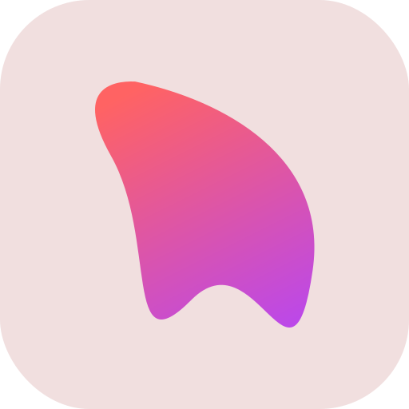

<div align="center">
  

  # Dia

  **A modern, open-source Discord bot with a realtime dashboard for teams that want control without bot sprawl.**

  [](https://github.com/dia-bot/dia/actions/workflows/ci.yml)
  [](https://pkg.go.dev/github.com/dia-bot/dia)
  [](https://go.dev/)
  [](https://elixir-lang.org/)
  [](https://kit.svelte.dev/)
  [](deploy/docker-compose.yml)
  [](#license)
</div>

---

## What is Dia?

Dia is a Discord bot you configure from a clean web dashboard. It is
slash-command native, fully self-hostable, and built around realtime guild state:
create a channel in Discord and it appears in the dashboard without a refresh.

It combines the features most communities install as separate bots into one
operational stack that can run locally, in Docker, or across multiple gateway
nodes when your communities grow.

## Highlights

| Area | What Dia provides |
| --- | --- |
| Dashboard | OAuth login, per-server settings, image previews, and live guild updates |
| Engagement | Welcome images, rank cards, XP, levels, leaderboards, and role rewards |
| Roles | Button/select reaction roles and automatic roles on member join |
| Moderation | Ban, kick, timeout, warn, case logs, spam rules, invite filters, link filters, and banned words |
| Commands | Custom slash commands designed from the dashboard |
| Operations | Docker Compose, embedded migrations, Redis cache, Postgres storage, and NATS-backed event delivery |

## Features

- **Welcome**: greet members with custom messages and rendered welcome-card
  images. Pick a preset or design your own with a live preview.
- **Leveling**: XP, levels, role rewards, leaderboards and generated rank cards.
- **Reaction & auto roles**: self-assignable roles via buttons and select
  menus, plus automatic roles on join.
- **Moderation & automod**: ban / kick / timeout / warn with a case log, and
  rule-based automod for spam, invites, links and banned words.
- **Custom commands**: design your own slash commands from the dashboard, no
  code required.

## Architecture

Dia is split into tiers, each using the right tool for the job. The gateway only
normalizes Discord events, the worker owns bot behavior, and the API owns the
dashboard contract.

| Tier | Stack |
| --- | --- |
| Discord gateway | Sharded WebSocket connections through Elixir and Nostrum |
| Event bus | NATS JetStream subjects like `discord.events.<type>.<guild_id>` |
| Worker | Go plugins for interactions, XP, automod, roles, welcome images, and custom commands |
| API | Go and gin for OAuth, sessions, config CRUD, previews, and realtime WebSocket updates |
| Data | PostgreSQL for durable config, Redis for cache, sessions, and live guild snapshots |
| Web | SvelteKit 2, Svelte 5 runes, TypeScript, and Tailwind CSS v4 |

## Tech stack

| Layer | Tools |
| --- | --- |
| Gateway | Elixir, Nostrum, gnat |
| Backend | Go, gin, pgx, go-redis, goose |
| Bot SDK | Internal plugin framework plus vendored Discord REST client |
| Imaging | fogleman/gg and image helpers for welcome and rank cards |
| Frontend | SvelteKit, Svelte 5, TypeScript, Tailwind CSS |
| Infrastructure | Docker Compose, Postgres, Redis, NATS JetStream |

## Quick start (development)

```bash
cp .env.example .env          # fill in DISCORD_TOKEN, DISCORD_CLIENT_ID/SECRET, SESSION_SECRET
make infra-up                 # Postgres + Redis + NATS via docker

# in separate terminals:
make api                      # Go dashboard API on :8080 (runs migrations)
make worker                   # Go bot worker
make gateway-deps && make gateway   # Elixir gateway (needs DISCORD_TOKEN)
make web-install && make web        # SvelteKit dev server on :5173
```

Open http://localhost:5173 and log in with Discord.

## Quick start (Docker, full stack)

```bash
cp .env.example .env          # set DISCORD_* and SESSION_SECRET (openssl rand -hex 32)
docker compose -f deploy/docker-compose.yml up -d --build
```

Dashboard on http://localhost:3000, API on http://localhost:8080.

## Scaling across machines

Run the Elixir gateway on multiple nodes and split the shards by config. No code
changes:

```bash
SHARD_TOTAL=16 NODE_COUNT=4 NODE_INDEX=0  # node 0 owns shards 0-3
SHARD_TOTAL=16 NODE_COUNT=4 NODE_INDEX=1  # node 1 owns shards 4-7, etc.
```

The Go worker and API are stateless and scale horizontally behind NATS durable
consumers.

## Project structure

```text
gateway/         Elixir gateway (Nostrum to NATS)
cmd/worker       Go bot worker (consumes events, runs plugins)
cmd/api          Go dashboard API (gin)
internal/        Go libraries: eventbus, store, discord, imaging, plugin SDK,
                 interactions, bot runtime, api, realtime, guildstate, features/*
pkg/discordgo    vendored Discord library (REST + types)
migrations/      versioned SQL (goose, embedded)
web/             SvelteKit landing + dashboard
deploy/          full-stack docker-compose + k8s
```

### Extending Dia

Features are plugins implementing a tiny SDK (`internal/plugin`). A plugin
declares its slash commands, component/modal handlers, event subscriptions and
background workers in `Init`, and stores its config as JSON keyed by a feature
key. See `internal/features/welcome` for the canonical example.

## Contributing

See [CONTRIBUTING.md](CONTRIBUTING.md) for local setup, checks, and pull request
guidelines.

## License

MIT
